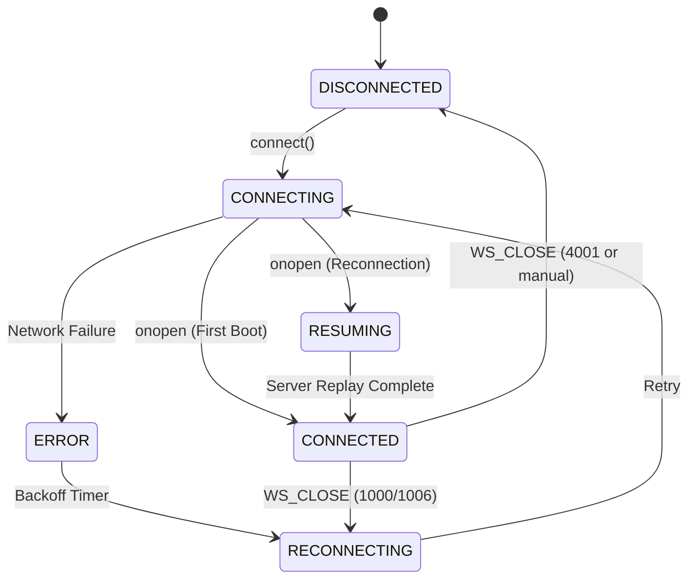
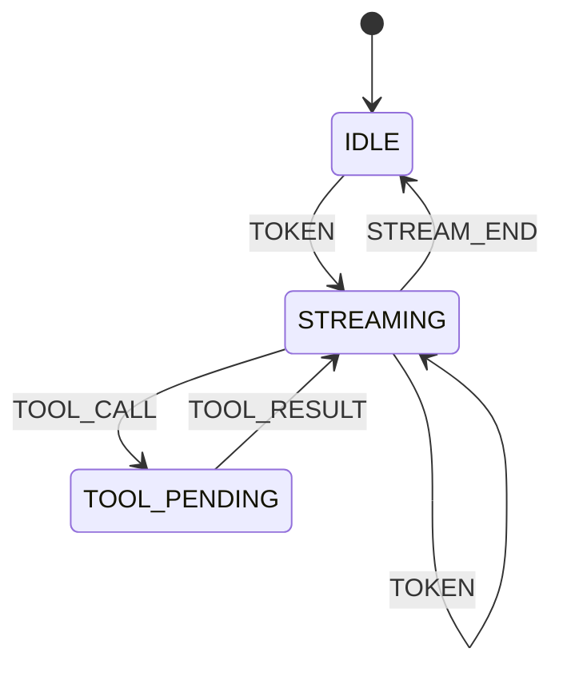

# Protocol State Machine

The Agent Console uses an explicit state machine to manage the lifecycle of the WebSocket connection and the incoming token streams.

## Connection Lifecycle

## Stream Lifecycle

Transitions:
- **DISCONNECTED**: Terminal state. Reconnection halted.
- **CONNECTING**: Socket initiating handshake.
- **CONNECTED**: Normal bidirectional communication.
- **STREAMING**: Actively appending tokens to the active stream ID.
- **TOOL_PENDING**: Token stream frozen. Waiting for TOOL_RESULT to resume.
- **RECONNECTING**: Waiting on exponential backoff timer.
- **RESUMING**: Connection established, awaiting flushed buffer from `last_seq` replay.
- **ERROR**: Temporary failure state before retry schedule.
